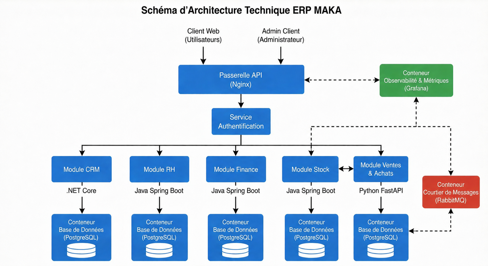

<p align="center">
  
</p>

<h1 align="center">MAKA — ERP Modulaire Microservices & IA</h1>

<p align="center">
  <strong>Solution ERP moderne et polyglotte pour la gestion d'entreprise intelligente</strong><br>
  CRM · Finance · Stock · RH · Sales · Intelligence Artificielle
</p>

<p align="center">
  
  
  
  
  
  
  
</p>

---

## 📋 Présentation

Le projet **MAKA** est un ERP (Enterprise Resource Planning) de nouvelle génération conçu pour centraliser la gestion d'une entreprise via une architecture **microservices polyglotte**. 

L'écosystème orchestre **24 conteneurs Docker** incluant 6 microservices métiers, une infrastructure de messagerie RabbitMQ, du cache Redis et une stack d'observabilité SRE complète.

---

## 🏗️ Architecture Technique

<p align="center">
  
</p>

L'architecture repose sur une isolation stricte des données (une base PostgreSQL par service) et une communication sécurisée via un **API Gateway Nginx**.

### 🧩 Les 6 Microservices

| Service | Technologie | Rôle Principal | Base de données |
|:---:|:---:|---|:---:|
| **Auth** | Symfony 7 | Gestion JWT RSA, RBAC, Profils | `auth_db` |
| **CRM** | .NET 8 | Leads, Opportunités, Campagnes, Tickets | `crm_db` |
| **Finance** | Spring Boot 3 | Facturation, Paiements, Journal Comptable | `finance_db` |
| **Stock** | Spring Boot 3 | Stocks (JDBC), Mouvements, Inventaires | `stock_db` |
| **HR** | Spring Boot 3 | Employés, Contrats, Congés, Paie | `hr_db` |
| **Sales & IA** | FastAPI | Ventes, Scraping, Modules IA (ML/RAG) | `sales_db` |

---

## 🤖 Intelligence Artificielle & Data Science

MAKA intègre un module d'intelligence artificielle avancé (FastAPI / Scikit-Learn) :
- **Lead Scoring** : Prédiction de conversion des prospects via Random Forest.
- **Sales Forecast** : Prédiction des ventes futures via Gradient Boosting.
- **Client Segmentation** : Regroupement automatique (K-Means) pour marketing ciblé.
- **Chatbot RAG++** : Assistant intelligent (Gemini/OpenRouter) avec accès au contexte métier.
- **Cross-Analytics** : Calcul du score de santé global de l'entreprise (0-100).

---

## 🔐 Sécurité & Authentification (JWT RSA)

Le système utilise une authentification asymétrique **RSA**. Le service Auth signe les jetons avec une clé privée, tandis que les autres services valident les accès de manière autonome avec la clé publique.

| Rôle | CRM | Finance | Stock | RH | Admin |
|:---:|:---:|:---:|:---:|:---:|:---:|
| **ADMIN** | ✅ | ✅ | ✅ | ✅ | ✅ |
| **COMMERCIAL** | ✅ | ❌ | ✅ | ❌ | ❌ |
| **COMPTABLE** | ❌ | ✅ | ❌ | ❌ | ❌ |
| **RH_MANAGER** | ❌ | ❌ | ❌ | ✅ | ❌ |

---

## 📊 Observabilité & SRE

Une stack complète assure la résilience du système :
- **Supervision** : Prometheus (métriques) & Grafana (dashboards live).
- **Disponibilité** : Blackbox Exporter & Health Checks automatiques.
- **Logs** : Stack ELK (Elasticsearch, Logstash, Kibana) centralisée.
- **Infrastructure** : cAdvisor & Docker Stats pour le suivi des ressources.

---

## 🚀 Démarrage Rapide

### 1. Backend (Docker)
```bash
cd services
docker compose up -d --build
```

### 2. Frontend (Local)
```bash
cd frontend
npm install
npm start
```

**Accès :**
- 💻 App : `http://localhost:4200`
- 🛡️ Gateway : `http://localhost:8000`
- 📈 Grafana : `http://localhost:3000` (admin/admin)
- 🐰 RabbitMQ : `http://localhost:15672` (maka/maka_secret)

---

## 👥 Équipe de Développement

- **Marwan Kiker**
- **Abdellah Ajebli**
- **Abdelilah Hamdaoui**
- **Abderrahmane Missaoui**


