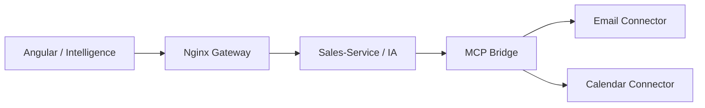

# Integration MCP Email et Agenda

## Objectif

Le module MAKA Intelligence expose une couche MCP Bridge pour preparer l'integration avec des outils externes comme l'email et l'agenda.

Par defaut, aucun email n'est envoye et aucun evenement n'est cree. Le service fonctionne en mode local :

- generation d'un brouillon email ;
- generation d'une proposition d'evenement agenda ;
- affichage de l'etat des connecteurs dans l'interface Intelligence.

## Routes disponibles

| Methode | Route | Role |
| --- | --- | --- |
| GET | `/api/sales/ai/mcp/status` | Etat des connecteurs Email et Agenda |
| POST | `/api/sales/ai/mcp/email/draft` | Cree un brouillon email ou l'envoie vers un connecteur MCP |
| POST | `/api/sales/ai/mcp/calendar/event` | Cree une proposition d'evenement ou l'envoie vers un connecteur MCP |

## Configuration

Les variables suivantes sont optionnelles :

```env
MCP_EMAIL_CONNECTOR_URL=
MCP_CALENDAR_CONNECTOR_URL=
MCP_CONNECTOR_TOKEN=
MCP_TIMEOUT_SECONDS=8
```

Lorsque les URLs sont vides, le backend repond en mode local. Lorsque les URLs sont renseignees, le Sales-Service transmet les requetes vers le connecteur MCP configure.

## Exemple email

```powershell
$body = @{
  to = @("client@example.com")
  subject = "Relance devis"
  body = "Bonjour, je vous contacte concernant votre devis en attente."
  context = "CRM"
} | ConvertTo-Json

Invoke-RestMethod -Method Post `
  -Uri "http://localhost:8000/api/sales/ai/mcp/email/draft" `
  -ContentType "application/json" `
  -Body $body
```

## Exemple agenda

```powershell
$body = @{
  title = "Reunion de suivi client"
  start = "2026-05-11T10:00:00"
  end = "2026-05-11T10:30:00"
  attendees = @("client@example.com")
  description = "Point de suivi commercial"
  timezone = "Africa/Casablanca"
} | ConvertTo-Json

Invoke-RestMethod -Method Post `
  -Uri "http://localhost:8000/api/sales/ai/mcp/calendar/event" `
  -ContentType "application/json" `
  -Body $body
```

## Position dans l'architecture



Cette approche garde le coeur ERP independant des fournisseurs externes. Gmail, Outlook, Google Calendar ou Outlook Calendar peuvent etre branches plus tard sans changer les routes du frontend.
