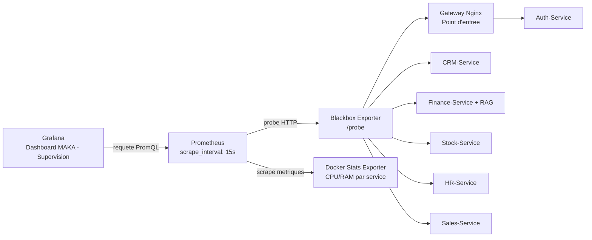

# Observabilite SRE - ERP MAKA Intelligence

## Objectif

Cette section decrit le systeme de supervision de l'ERP MAKA Intelligence selon une approche SRE (Site Reliability Engineering). L'objectif est de montrer comment chaque microservice est observe, comment les donnees de disponibilite circulent entre Prometheus, Blackbox Exporter et Grafana, et comment les metriques CPU/RAM permettent de prouver la robustesse de la plateforme pendant les tests de performance.

Le systeme de supervision repose sur quatre blocs principaux :

- Prometheus collecte les metriques et planifie les controles periodiques.
- Blackbox Exporter teste les endpoints HTTP des services comme un utilisateur ou une gateway le ferait.
- Docker Stats Exporter expose les metriques CPU/RAM par conteneur avec un label `service`.
- Grafana affiche les donnees dans le dashboard `MAKA - Supervision`.

## Flux Global



Dans Prometheus, le job `service-availability` est le nom technique du controle Blackbox. Dans Grafana, il ne faut pas afficher ce nom comme nom de service. Les panels doivent utiliser le label `service`, par exemple avec la legende `{{service}}`, afin d'afficher `gateway`, `auth-service`, `crm-service`, `finance-service`, `stock-service`, `hr-service` et `sales-service`.

## Circulation par Service

| Service | Role metier | Endpoint supervise | Flux de supervision |
| --- | --- | --- | --- |
| Gateway | Point d'entree unique de l'ERP. Elle route les appels du frontend vers les microservices internes. | `http://gateway/health` | Prometheus lance un probe vers Blackbox Exporter. Blackbox appelle la Gateway sur le reseau Docker. Le resultat revient sous forme de metrique `probe_success{service="gateway"}` puis Grafana l'affiche. |
| Auth-Service | Securite, authentification, gestion JWT/RSA et controle des roles. | `http://gateway/api/auth/profile` | Le controle passe volontairement par la Gateway afin de tester le chemin reel d'acces securise. Un statut HTTP 200, 401 ou 403 peut rester valide pour la supervision, car il prouve que la Gateway et le service Auth repondent. |
| CRM-Service | Gestion commerciale : leads, opportunites, comptes, contacts et interactions client. | `http://crm-service:5000/swagger/v1/swagger.json` | Prometheus demande a Blackbox de tester directement le service CRM sur le reseau interne Docker. Le retour alimente `probe_success{service="crm-service"}` et `probe_duration_seconds{service="crm-service"}`. |
| Finance-Service | Gestion financiere : factures, paiements, comptes bancaires, journal comptable et module d'intelligence/RAG associe au traitement financier. | `http://finance-service:6000/actuator/health` | Blackbox teste la sante HTTP du service. En parallele, Prometheus scrape aussi `http://finance-service:6000/actuator/prometheus` pour les metriques Spring Boot comme le taux de requetes et la latence applicative. |
| Stock-Service | Gestion des articles, inventaire, mouvements de stock et disponibilite des produits. | `http://stock-service:8083/actuator/health` | Blackbox controle la disponibilite du service. Prometheus collecte aussi les metriques Spring via `/actuator/prometheus`, ce qui permet de suivre les requetes et la performance du module stock. |
| HR-Service | Ressources humaines : employes, conges, donnees RH et operations administratives. | `http://hr-service:8080/api/hr/employes` | Le probe teste un endpoint metier simple afin de verifier que l'API RH est joignable et capable de repondre. Les metriques Spring sont collectees via `/actuator/prometheus`. |
| Sales-Service | Gestion commerciale avancee : ventes, flux sales et endpoints lies aux traitements metier du module Sales. | `http://sales-service:8004/api/sales/health` | Blackbox appelle l'endpoint de sante du service Sales. Le resultat est stocke dans Prometheus avec le label `service="sales-service"` puis visualise dans Grafana. |

## Metriques Affichees dans Grafana

Le dashboard `MAKA - Supervision` utilise plusieurs familles de metriques.

| Besoin SRE | Requete PromQL recommandee | Interpretation |
| --- | --- | --- |
| Disponibilite par service | `probe_success{job="service-availability"}` | `1` signifie que le service repond, `0` signifie une indisponibilite ou une erreur reseau/applicative. |
| Temps de reponse par service | `probe_duration_seconds{job="service-availability"}` | Mesure la duree du controle Blackbox pour detecter une degradation avant la panne. |
| CPU par service | `maka_container_cpu_percent{service!=""}` | Affiche la consommation CPU de chaque conteneur avec son vrai nom de service. |
| Memoire par service | `maka_container_memory_usage_bytes{service!=""}` | Permet de verifier la stabilite RAM et de detecter les fuites memoire. |
| Requetes HTTP Spring | `sum(rate(http_server_requests_seconds_count[5m])) by (job, status, uri)` | Permet d'analyser les modules Spring Boot : Finance, Stock et HR. |

Pour eviter l'affichage `service-availability` dans Grafana, les panels de disponibilite et de latence doivent utiliser :

```text
Legend: {{service}}
```

`service-availability` reste utile cote Prometheus comme nom du job, mais le nom fonctionnel pour le jury est le label `service`.

## Frequence des Requetes de Supervision

Dans `services/observability/prometheus/prometheus.yml`, la frequence globale est :

```yaml
global:
  scrape_interval: 15s
  evaluation_interval: 15s
```

Un intervalle de 15 secondes est un bon compromis pour ce projet :

- il donne une vision presque temps reel pendant les tests k6 ;
- il detecte rapidement une panne ou une degradation ;
- il evite de surcharger les microservices avec des controles trop frequents ;
- il donne assez de points de mesure pour visualiser les tendances CPU, RAM et disponibilite dans Grafana.

Pour les tests de performance courts, par exemple 50 utilisateurs pendant 3 secondes, il faut garder Grafana sur une fenetre de temps courte mais suffisante, par exemple `Last 5 minutes` ou `Last 15 minutes`, afin de voir le pic de charge.

## Analyse CPU/RAM pour la Soutenance

Une consommation CPU/RAM stable dans Grafana est un indicateur fort de robustesse pour un jury, car elle montre que l'architecture ne se contente pas de repondre a une requete isolee : elle reste stable sous charge.

Pendant un test de performance, il faut observer :

- `probe_success = 1` pour chaque service critique ;
- une latence Blackbox raisonnable et sans hausse continue ;
- un CPU qui monte pendant la charge puis redescend apres le test ;
- une RAM qui reste stable, sans croissance continue apres la fin du test ;
- un taux d'erreurs k6 faible ou nul ;
- des logs centralises dans Elasticsearch/Kibana pour expliquer les erreurs eventuelles.

Pour le rapport, l'argument SRE est le suivant : si 50 utilisateurs simultanes generent une charge et que les services restent disponibles, avec CPU/RAM maitrises et sans fuite memoire visible, alors l'ERP MAKA Intelligence demontre une bonne isolation des microservices, une observabilite exploitable et une capacite de diagnostic en production.

## Commandes de Test et d'Export

Test de charge complet avec 50 utilisateurs pendant 3 secondes, depuis la racine `MAKA` :

```cmd
docker run --rm -i --network services_hub-network -v "%cd%\performance:/scripts" grafana/k6:0.53.0 run -e BASE_URL=http://gateway -e AUTH_EMAIL=marouankiker@gmail.com -e AUTH_PASSWORD=admin123 -e VUS=50 -e DURATION=3s /scripts/k6/maka-load-test.js
```

Export des donnees Prometheus et Elasticsearch pour le rapport :

```powershell
powershell -ExecutionPolicy Bypass -File .\performance\scripts\export-observability.ps1
```

Les preuves sont generees dans :

```text
performance/exports/prometheus
performance/exports/elasticsearch
```

Ces exports permettent d'integrer au rapport des donnees reelles : disponibilite, latence, CPU, RAM, taux de requetes et logs centralises.
