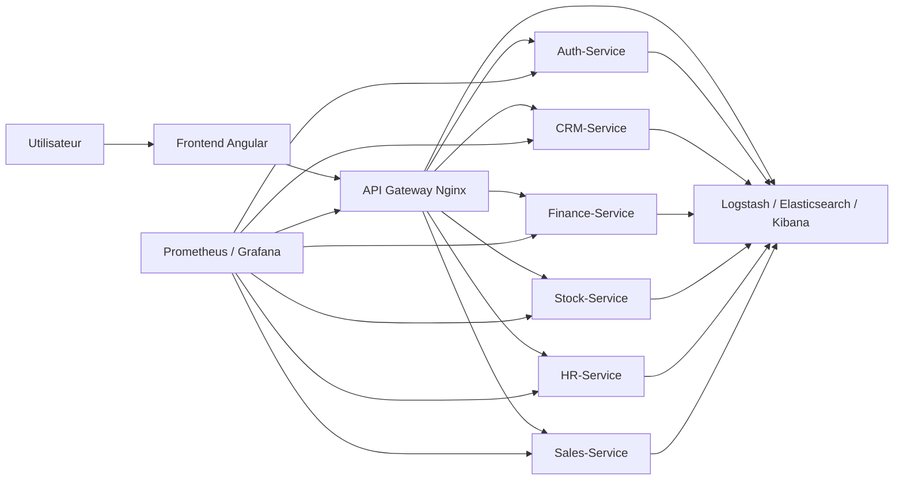

# Rapport Academique - ERP MAKA Intelligence

## Titre du projet

**Conception et mise en oeuvre d'un ERP modulaire base sur une architecture microservices avec supervision, centralisation des logs et tests de performance**

## Resume

Le projet **MAKA Intelligence** consiste a concevoir et deployer une solution ERP modulaire permettant de centraliser plusieurs fonctions essentielles de l'entreprise, notamment l'authentification, la gestion commerciale, la finance, le stock, les ressources humaines et les ventes. Le systeme repose sur une architecture microservices, dans laquelle chaque domaine metier est isole dans un service independant, communiquant avec les autres composants a travers une API Gateway.

L'objectif principal du projet est de proposer une plateforme evolutive, securisee et observable. Pour cela, l'application integre une stack de supervision composee de Prometheus, Grafana, Blackbox Exporter, Docker Stats Exporter, Elasticsearch, Logstash et Kibana. Cette stack permet de suivre l'etat des services, la consommation CPU/RAM, les temps de reponse, les logs applicatifs et les resultats des tests de performance.

Le projet s'inscrit dans une demarche DevOps et SRE, car il ne se limite pas au developpement fonctionnel de l'ERP. Il integre aussi les mecanismes necessaires pour surveiller, tester et diagnostiquer le comportement du systeme en conditions proches de la production.

## Introduction

Les entreprises modernes utilisent de plus en plus des systemes d'information capables de centraliser leurs processus internes. Un ERP permet de regrouper plusieurs modules metiers dans une meme plateforme : finance, gestion commerciale, stock, ressources humaines, ventes et administration. Cependant, les architectures monolithiques traditionnelles peuvent devenir difficiles a maintenir lorsque le nombre de fonctionnalites augmente.

Pour repondre a cette problematique, le projet MAKA Intelligence adopte une architecture microservices. Chaque service est responsable d'un domaine metier precis et peut etre developpe, teste, deployee et supervise de maniere independante. Cette approche favorise la modularite, la scalabilite et l'isolation des pannes.

Dans un contexte academique, l'interet du projet reside dans la combinaison de plusieurs aspects techniques : developpement full-stack, securite JWT/RSA, conteneurisation Docker, supervision Prometheus/Grafana, centralisation des logs avec la stack Elastic et tests de charge avec k6.

## Problematique

La problematique principale du projet peut etre formulee comme suit :

**Comment concevoir un ERP moderne, modulaire et securise, tout en garantissant la supervision, la tracabilite et la verification de ses performances dans une architecture microservices ?**

Cette problematique implique plusieurs sous-questions :

- comment separer les responsabilites metier entre plusieurs services independants ;
- comment centraliser l'acces aux APIs a travers une Gateway ;
- comment securiser les communications avec un mecanisme d'authentification robuste ;
- comment superviser chaque service avec des metriques exploitables ;
- comment centraliser les logs pour faciliter le diagnostic ;
- comment tester la resistance du systeme face a plusieurs utilisateurs simultanes.

## Objectifs du projet

Les objectifs fonctionnels du projet sont :

- offrir une interface ERP moderne pour la gestion d'entreprise ;
- fournir un module d'authentification et de gestion des roles ;
- gerer les donnees commerciales a travers le module CRM ;
- gerer les factures, paiements et operations financieres ;
- assurer la gestion du stock et des articles ;
- integrer des modules RH et Sales ;
- permettre l'acces controle aux fonctionnalites selon le role de l'utilisateur.

Les objectifs techniques sont :

- adopter une architecture microservices ;
- conteneuriser l'ensemble des services avec Docker Compose ;
- utiliser une API Gateway Nginx comme point d'entree unique ;
- separer les bases de donnees par domaine metier ;
- integrer une supervision Prometheus/Grafana ;
- centraliser les logs avec Elasticsearch, Logstash et Kibana ;
- executer des tests de performance avec k6 ;
- exporter les donnees de supervision pour les exploiter dans le rapport.

## Architecture generale

L'architecture de MAKA Intelligence repose sur plusieurs couches :

- **Frontend Angular** : interface utilisateur de l'ERP.
- **API Gateway Nginx** : point d'entree unique vers les microservices.
- **Microservices metier** : Auth, CRM, Finance, Stock, HR et Sales.
- **Bases de donnees PostgreSQL** : une base dediee par domaine metier.
- **Infrastructure d'observabilite** : Prometheus, Grafana, Blackbox Exporter, Docker Stats Exporter.
- **Centralisation des logs** : Logstash, Elasticsearch et Kibana.



## Description des modules

### Gateway

La Gateway constitue le point d'entree principal du systeme. Elle recoit les requetes du frontend et les redirige vers le service correspondant. Cette couche simplifie l'acces aux APIs et permet de centraliser certaines regles de routage.

### Auth-Service

Le service d'authentification gere la connexion des utilisateurs, la generation des jetons JWT et le controle des roles. Il repose sur une logique de securite basee sur la signature RSA. Cette approche permet aux autres services de verifier l'authenticite d'un token sans interroger directement la base de donnees du service Auth.

### CRM-Service

Le CRM-Service gere les processus commerciaux : leads, opportunites, comptes, contacts et interactions. Il represente le coeur de l'activite commerciale de l'ERP.

### Finance-Service

Le Finance-Service gere les factures, les paiements, les comptes bancaires et le journal comptable. Il integre egalement une logique d'intelligence/RAG associee a l'analyse et au traitement des donnees financieres.

### Stock-Service

Le Stock-Service gere les articles, les mouvements de stock et les informations liees a l'inventaire. Son isolation permet de separer clairement la logique logistique du reste de l'ERP.

### HR-Service

Le HR-Service concerne les ressources humaines. Il permet de suivre les employes et les donnees administratives associees.

### Sales-Service

Le Sales-Service couvre les fonctionnalites liees aux ventes et aux traitements commerciaux avances. Il complete le CRM en fournissant des endpoints specialises pour l'activite sales.

## Choix technologiques

Le projet utilise plusieurs technologies adaptees aux besoins de chaque module :

| Composant | Technologie | Justification |
| --- | --- | --- |
| Frontend | Angular | Framework robuste pour les applications web modulaires. |
| Gateway | Nginx | Reverse proxy performant et simple a configurer. |
| Auth-Service | Symfony / PHP | Adaptation aux besoins de securite et de gestion utilisateur. |
| CRM-Service | .NET 8 | Performance, typage fort et architecture propre. |
| Finance-Service | Spring Boot | Ecosysteme mature pour les applications metier Java. |
| Stock-Service | Spring Boot | Integration naturelle avec Actuator et Prometheus. |
| HR-Service | Spring Boot | Exposition de metriques applicatives via Actuator. |
| Conteneurisation | Docker Compose | Lancement reproductible de l'ensemble de la stack. |
| Supervision | Prometheus / Grafana | Collecte et visualisation des metriques. |
| Logs | ELK | Centralisation, indexation et recherche des logs. |
| Performance | k6 | Tests de charge simples et automatisables. |

## Securite

La securite du projet repose sur un mecanisme JWT signe avec des cles RSA. Lorsqu'un utilisateur s'authentifie, le service Auth genere un token contenant les informations necessaires, notamment le role de l'utilisateur. Les services metier peuvent ensuite verifier ce token a l'aide de la cle publique.

Cette separation presente plusieurs avantages :

- le service Auth reste le seul responsable de l'identite ;
- les autres services n'ont pas besoin d'acceder directement a la base Auth ;
- la verification du token est rapide et decentralisee ;
- les droits d'acces peuvent etre controles selon les roles.

Dans une architecture microservices, cette approche reduit le couplage entre les services et ameliore la securite globale.

## Supervision et observabilite

La supervision constitue une partie essentielle du projet. Elle permet de repondre a une question fondamentale : **est-ce que chaque service fonctionne correctement et reste stable sous charge ?**

Le systeme utilise Prometheus pour collecter les metriques. La frequence de collecte est configuree a 15 secondes :

```yaml
global:
  scrape_interval: 15s
  evaluation_interval: 15s
```

Cette frequence represente un compromis entre precision et charge systeme. Elle permet de detecter rapidement une panne ou une degradation sans surcharger inutilement les services.

Les endpoints supervises sont :

| Service | Endpoint de supervision | Type de controle |
| --- | --- | --- |
| Gateway | `http://gateway/health` | Disponibilite HTTP |
| Auth-Service | `http://gateway/api/auth/profile` | Controle via Gateway |
| CRM-Service | `http://crm-service:5000/swagger/v1/swagger.json` | Disponibilite API |
| Finance-Service | `http://finance-service:6000/actuator/health` | Health Spring Boot |
| Stock-Service | `http://stock-service:8083/actuator/health` | Health Spring Boot |
| HR-Service | `http://hr-service:8080/api/hr/employes` | Endpoint metier simple |
| Sales-Service | `http://sales-service:8004/api/sales/health` | Health applicatif |

Grafana affiche les indicateurs suivants :

- disponibilite par service ;
- temps de reponse par service ;
- consommation CPU par conteneur ;
- consommation memoire par conteneur ;
- taux de requetes HTTP pour les services Spring ;
- etat global des services supervises.

L'affichage par nom de service est essentiel dans un contexte academique, car il permet au jury d'identifier rapidement l'etat de chaque composant metier.

## Centralisation des logs

La centralisation des logs est assuree par Logstash, Elasticsearch et Kibana. Les conteneurs applicatifs envoient leurs logs vers Logstash via le driver GELF. Logstash transforme ensuite ces logs et les stocke dans Elasticsearch avec un index de type :

```text
maka-logs-YYYY.MM.dd
```

Kibana permet ensuite de creer une vue de donnees, par exemple :

```text
maka-logs-*
```

Cette centralisation permet :

- de rechercher les erreurs applicatives ;
- de suivre les logs de plusieurs services depuis une seule interface ;
- de correler les incidents avec les metriques Prometheus ;
- de fournir des preuves techniques dans le rapport de soutenance.

## Tests de performance

Les tests de performance sont realises avec k6. L'objectif est de simuler plusieurs utilisateurs qui appellent les endpoints principaux de l'ERP.

Les endpoints publics testes sont :

- `gateway_health` ;
- `auth_forgot_password` ;
- `crm_swagger` ;
- `finance_health` ;
- `stock_health` ;
- `hr_employes` ;
- `sales_health`.

Les endpoints authentifies testes, lorsqu'un compte valide est fourni, sont :

- `crm_leads` ;
- `finance_factures` ;
- `stock_articles`.

La commande suivante permet de simuler 50 utilisateurs pendant 3 secondes :

```cmd
docker run --rm -i --network services_hub-network -v "%cd%\performance:/scripts" grafana/k6:0.53.0 run -e BASE_URL=http://gateway -e AUTH_EMAIL=marouankiker@gmail.com -e AUTH_PASSWORD=admin123 -e VUS=50 -e DURATION=3s /scripts/k6/maka-load-test.js
```

Durant ce test, Grafana permet d'observer l'evolution de la charge CPU, de la memoire, de la disponibilite et des temps de reponse. Kibana permet de verifier si des erreurs applicatives apparaissent au meme moment.

## Interpretation des resultats

L'analyse des resultats doit se baser sur plusieurs indicateurs :

| Indicateur | Interpretation |
| --- | --- |
| `probe_success = 1` | Le service est disponible. |
| Temps de reponse stable | Le service repond sans degradation importante. |
| CPU controle | Le service absorbe la charge sans saturation. |
| RAM stable | Absence de fuite memoire visible pendant le test. |
| Taux d'erreur k6 faible | Les endpoints repondent correctement. |
| Logs centralises | Les erreurs sont tracables et analysables. |

Dans un rapport academique, une consommation CPU/RAM stable est un argument important. Elle montre que l'architecture ne fonctionne pas uniquement dans un cas nominal, mais qu'elle conserve un comportement previsible sous charge. Si la RAM augmente continuellement apres la fin du test, cela peut indiquer une fuite memoire. Si le CPU reste constamment eleve, cela peut indiquer une saturation ou une mauvaise optimisation.

Un test initial realise sur la Gateway a montre un taux de verification de 100 %, un taux d'erreur de 0 % et des temps de reponse faibles. Pour une evaluation complete, il faut comparer ces resultats avec les tests multi-services et les donnees exportees depuis Prometheus.

## Export des donnees de supervision

Le projet contient un script permettant d'exporter les donnees Prometheus et Elasticsearch :

```powershell
powershell -ExecutionPolicy Bypass -File .\performance\scripts\export-observability.ps1
```

Les donnees exportees sont stockees dans :

```text
performance/exports/prometheus
performance/exports/elasticsearch
```

Ces fichiers peuvent etre utilises comme preuves dans le rapport final. Ils permettent de justifier les analyses par des donnees reelles et non seulement par des captures d'ecran.

## Apports du projet

Le projet MAKA Intelligence presente plusieurs apports :

- mise en place d'une architecture ERP modulaire ;
- separation claire des domaines metier ;
- securisation des acces par JWT/RSA ;
- deploiement conteneurise avec Docker Compose ;
- supervision temps reel des microservices ;
- centralisation des logs applicatifs ;
- execution de tests de charge reproductibles ;
- creation d'exports exploitables dans un rapport academique.

Ce travail montre une comprehension avancee des architectures modernes et des pratiques DevOps appliquees a un projet ERP.

## Limites et perspectives

Malgre les resultats obtenus, certaines ameliorations peuvent etre envisagees :

- ajouter des tests de charge plus longs, par exemple 10 minutes ou 30 minutes ;
- definir des alertes Grafana en cas d'indisponibilite d'un service ;
- ajouter des dashboards specialises par module metier ;
- mettre en place une pipeline CI/CD complete ;
- renforcer la securite avec une gestion plus fine des secrets ;
- ajouter un tracing distribue avec OpenTelemetry ;
- deployer l'application sur un cluster Kubernetes pour tester la scalabilite horizontale.

## Conclusion

Le projet MAKA Intelligence propose une solution ERP moderne basee sur une architecture microservices. Il repond a des besoins metier concrets tout en integrant des exigences techniques importantes : securite, modularite, observabilite, centralisation des logs et verification des performances.

L'integration de Prometheus, Grafana, Blackbox Exporter, Docker Stats Exporter, Elasticsearch, Logstash, Kibana et k6 permet de transformer l'application en un systeme observable. Cette observabilite est essentielle pour une architecture microservices, car elle permet de detecter rapidement les pannes, d'analyser les performances et de justifier la robustesse du systeme devant un jury.

En conclusion, MAKA Intelligence ne se limite pas a un ERP fonctionnel. Le projet demontre aussi une maitrise des pratiques modernes de developpement, de deploiement et de supervision, ce qui en fait une base solide pour une evolution vers un environnement de production.

## Annexes recommandees

Pour completer le rapport final, il est recommande d'ajouter :

- une capture du dashboard Grafana `MAKA - Supervision` ;
- une capture de Prometheus Targets ;
- une capture Kibana Discover avec l'index `maka-logs-*` ;
- le resultat console d'un test k6 ;
- les fichiers exportes depuis `performance/exports/prometheus` ;
- les fichiers exportes depuis `performance/exports/elasticsearch`.
